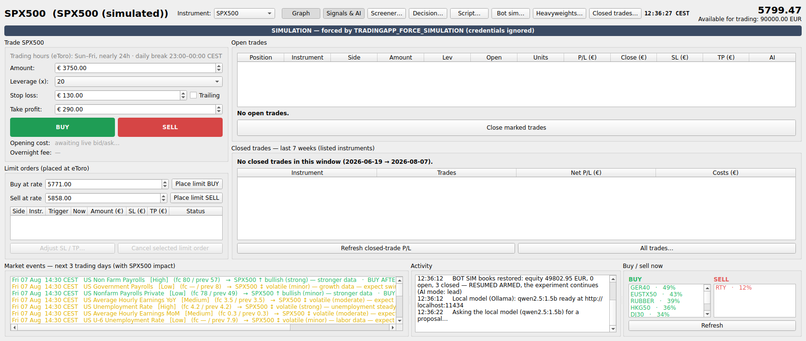
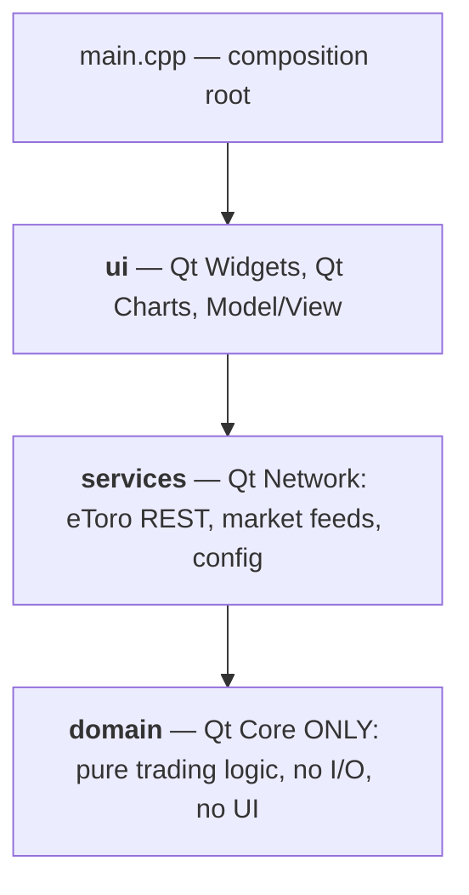

# eToro TradingApp

[](https://github.com/MartinSch77/TradingApp/actions/workflows/ci.yml)
[](https://github.com/MartinSch77/TradingApp/actions/workflows/tests.yml)
[](https://github.com/MartinSch77/TradingApp/actions/workflows/tests.yml)
[](https://github.com/MartinSch77/TradingApp/releases/latest)
[](LICENSE)

*A cross-platform Qt 6/C++23 trading workbench and software-quality showcase
featuring Qt Widgets, Charts, Network, Squish, Coco, Test Center and Axivion.*



**[Try it without an account](#try-it-without-an-account)** ·
[What it does](#what-it-does) ·
[Why this is a Qt showcase](#why-this-is-a-qt-showcase) ·
[Quality evidence](#quality-evidence) ·
[Architecture](#architecture) ·
[Documentation](#documentation) ·
[Disclaimer](#disclaimer) ·
[License](#license)

## Try it without an account

The application runs fully in **SIMULATION** mode with no API keys, no credentials and
no network account — live prices, simulated money. That is the default when no key file
is present, and it can be forced.

```bash
# A ready-made build — no toolchain needed
#   https://github.com/MartinSch77/TradingApp/releases/latest
chmod +x TradingApp-*.AppImage && ./TradingApp-*.AppImage

# …or from source (provisions every open-source tool it needs)
git clone https://github.com/MartinSch77/TradingApp.git && cd TradingApp
./setup.sh && ./build_all.sh build && ./build/TradingApp
```

**[⬇ Download for Linux (x86-64 / ARM64), Windows, macOS or Android](https://github.com/MartinSch77/TradingApp/releases/latest)**

Forcing simulation explicitly, which is also what every GUI test does:

```bash
TRADINGAPP_FORCE_SIMULATION=1 ./build/TradingApp
```

Real money needs a key in git-ignored `apiKeyEtoro.json` and a deliberate switch to
`real` — see [docs/configuration.md](docs/configuration.md).

## What it does

- **One screen instead of many steps.** Amount, leverage and auto-proposed
  stop-loss/take-profit are always ready, so a trade is two deliberate clicks away.
  BUY and SELL are **double-press guarded**; money-moving actions cannot happen on one
  click.
- **A live chart and a leverage screener** across every instrument — indices, forex,
  commodities and eToro's thematic baskets. The instrument selector switches the whole
  application live.
- **A decision window that names its sources.** A composite call per instrument from a
  technical ensemble, TradingView, news sentiment, the volatility regime, Fear & Greed,
  intraday series, the session's own structure, and optionally a local LLM — each shown
  as its own row with its own read.
- **Nine independent reads, and their agreement.** Futures leadership, the leading
  future's own push, volatility *direction*, the US 10-year, the *shape* of the yield
  curve, heavyweight participation, how many heavyweights trade above their own session
  VWAP, where the session's volume sits, and the opening range. They do not come from
  one price series, so their agreement is actual evidence — and **a read that could not
  be measured never counts as agreement**.
- **A probability that was measured, not asserted.** The evidence score is not a
  probability. P(up) over 5/15/60/180 minutes comes only from the record: every
  evaluation is logged *including the ones that stayed out*, and until a band holds
  enough resolved samples the app says **UNCALIBRATED** and quotes no number. Hit rates
  are shown beside baselines on the same samples, because 58% right is worthless if
  always-long scored 61%.
- **A trading bot that simulates on live prices** and can never reach an order
  endpoint. It prices the whole round trip, aggregates risk by correlation rather than
  by count, learns from its own closes, and writes a human-readable line for every
  instrument it considered — traded or refused, with the reason either way.
- **Closed-trade history with real cost accounting** — half-spread per side, per-night
  rollover with the tripled weekend charge — and a macro event calendar. A simulation
  without costs measures nothing.

## Why this is a Qt showcase

The application is a real Qt 6 program rather than a demo: Qt Widgets, Qt Charts,
Qt Network, Qt Concurrent, Model/View and Qt Test all carry weight, and the layering is
enforced by the linker so the domain cannot reach a widget or a socket.

More unusually, it is built with **all four licensed Qt quality tools** wired into one
pipeline, and each is documented as a case study — problem, configuration, what it
found, the correction, the measurable result:

| Tool | What it found here |
|---|---|
| [Squish for Qt](docs/case-studies/squish.md) | On its first real run: an object map in the wrong place, and a widget name that never existed. 7 scenarios, 35 verifications. |
| [Squish Coco](docs/case-studies/coco.md) | That 90.5% line coverage hid **77% MC/DC**. Tests written against Coco's own unexecuted-condition list took it to ~88%. |
| [Qt Test Center](docs/case-studies/test-center.md) | That the first uploader POSTed to a REST endpoint that did not exist. The product ships `testcentercmd`. |
| [Axivion Suite](docs/case-studies/axivion.md) | Architecture as **code**, checked every run: 0 divergences, 0 absences. Also 154,183 rule findings, of which ~490 are actionable — and it is honestly not a gate. |

A full map of which Qt technology is used where, with one representative source file
per row, is in [docs/qt-framework-showcase.md](docs/qt-framework-showcase.md).

## Quality evidence

The point of this repository is that claims are backed by artefacts.
`tools/publish_release.sh` **refuses to publish** unless the tests are green, all seven
gated analyzers are at zero, the metrics ratchet is clean, traceability has no hard
gaps, and every artefact is newer than the newest source.

- **Requirements as code.** They live only in `requirements/requirements.sdoc`
  (StrictDoc); `docs/requirements.md` is generated. Every test carries its requirement
  and design tags, and `tools/trace_report.py` **fails the build on a hard gap** — so a
  new behaviour that nothing verifies cannot land.
- **Seven analyzers at zero**, gated: cppcheck, clang-tidy, Clang Static Analyzer,
  `g++ -fanalyzer`, clazy, PMD CPD (the clone gate) and codespell. Every disabled check
  carries a written reason *and* the measured hit count that justifies it.
- **Three sanitizers**: ASan+UBSan, TSan and valgrind.
- **Coverage at decision level**, not just lines: MC/DC via Coco and clang, with GUI
  coverage measured and reported **separately** so a well-covered domain cannot hide an
  untested interface.
- **A complexity ratchet**, not a threshold: existing debt is recorded with its
  numbers, and new debt, a worsened number or a stale entry all fail the stage.
- **Informational, deliberately not gates:** SonarCloud (its default gate fails on
  hotspot categories only a human can rule on) and Coverity Scan (weekly cron, because
  the free tier's submission cap makes per-push builds waste).

[](https://github.com/MartinSch77/TradingApp/actions/workflows/ci.yml)
[](https://github.com/MartinSch77/TradingApp/actions/workflows/ci.yml)
[](https://github.com/MartinSch77/TradingApp/actions/workflows/ci.yml)
[](https://sonarcloud.io/summary/new_code?id=MartinSch77_TradingApp)
[](https://sonarcloud.io/summary/new_code?id=MartinSch77_TradingApp)
[](https://scan.coverity.com/projects/TradingApp)

Most of this code was written with an AI assistant. The interesting question is how you
know it is right — [docs/ai-assisted-development.md](docs/ai-assisted-development.md)
answers it, including a section on what the harness demonstrably does **not** catch,
with real examples from this repository.

## Architecture

Three layers, one direction, enforced by the **linker** and independently verified as
an [architecture-as-code model](docs/case-studies/axivion.md) on every Axivion run.



`trading_domain` links Qt::Core and nothing else, so a domain file that reaches for a
socket or a widget **does not compile**. Details and per-module responsibilities:
[docs/architecture.md](docs/architecture.md).

## Documentation

| | |
|---|---|
| [Building on each platform](docs/platforms.md) | Linux (x86-64 and ARM64/Raspberry Pi), macOS, Android |
| [Windows](docs/windows.md) | MSVC, MinGW, and the PowerShell counterpart of every script |
| [Configuration and API keys](docs/configuration.md) | `apiKeyEtoro.json`, demo vs. real money, the safety gates |
| [The eToro API as used here](docs/etoro-api.md) | Endpoints, quirks, rate-limit pools, troubleshooting |
| [The trading bot](docs/bot.md) | Every switch, the risk model, the exit rules, the decision log |
| [Requirements](docs/requirements.md) · [Design](docs/design.md) · [Test spec](docs/test_spec.md) | The generated V-model documents |
| [Verification](docs/verification.md) · [Tools](docs/tools.md) | What is measured, how, and the gotchas that cost hours |
| [Qt quality tools](docs/qt-tools.md) | How to obtain, install and point this project at all four |
| [V-model](docs/vmodel.md) · [Qt framework map](docs/qt-framework-showcase.md) | Process and technology overviews |

## Disclaimer

Trading involves risk of financial loss. This is example software provided as-is, is
not affiliated with or endorsed by eToro, and is not financial advice. Verify every
order in eToro's own interface. Use `demo` mode until you fully trust the behaviour on
your account.

## License

TradingApp is free and open-source software licensed under the
GNU General Public License v3.0 or later.

It uses the Qt framework under its applicable open-source licenses.

The full text is in [LICENSE](LICENSE); everything the project links against or ships
is inventoried in [THIRD_PARTY_LICENSES.md](THIRD_PARTY_LICENSES.md), with the texts
under [`LICENSES/`](LICENSES/). Every source file carries an
`SPDX-License-Identifier: GPL-3.0-or-later` header.

Why GPL rather than something more permissive: **Qt Charts is offered under a
commercial licence or GPLv3 only — it has no LGPL option** — so a distributed binary
linking it must be GPLv3-compatible. The project was MIT until v1.0.2; MIT was not a
licence these binaries could actually be distributed under. Each release therefore also
attaches the corresponding source archive, as GPL-3.0-or-later requires.

Contributions welcome — see [CONTRIBUTING.md](CONTRIBUTING.md) and
[SECURITY.md](SECURITY.md) for the quality bar and how to report vulnerabilities.
